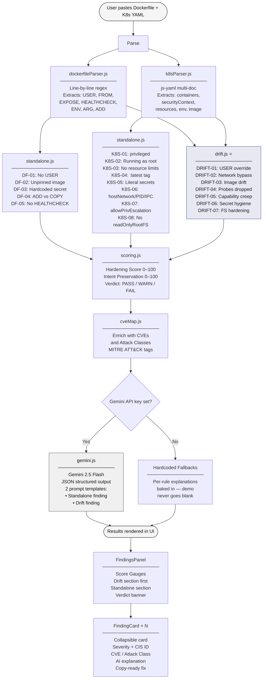
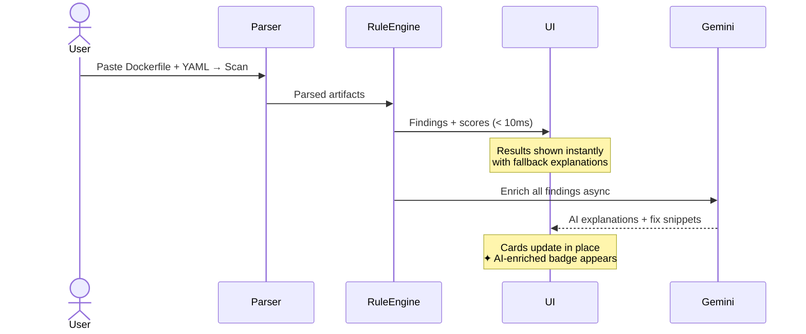

# 🔍 DriftGuard

**Container & Kubernetes Misconfiguration Scanner**

DriftGuard is the only scanner that cross-checks your **Dockerfile** against your **Kubernetes manifest** — catching where K8s silently undoes your Dockerfile security hardening.

---

## The Core Idea

Every other scanner (kube-bench, kubeaudit, Checkov, Kubesec, Trivy) analyses one file at a time. DriftGuard analyses both files **simultaneously** and finds the gap between *what you hardened* and *what actually ships*.

```
Dockerfile says:   USER appuser        (non-root)
K8s manifest says: runAsUser: 0        (root — your hardening is void)
                   ↑ DriftGuard catches this. Others don't.
```

---

## How It Works



### Two-phase UX



---

## Features

### Drift Engine ⭐ (unique)
7 cross-artifact rules that detect security intent reversals:

| Rule | What it catches |
|------|----------------|
| `DRIFT-01` | Dockerfile `USER` → K8s runs as root |
| `DRIFT-02` | Dockerfile `EXPOSE` → K8s `hostNetwork:true` nullifies it |
| `DRIFT-03` | Dockerfile FROM pinned → K8s deploys `:latest` |
| `DRIFT-04` | Dockerfile `HEALTHCHECK` → K8s has no probes |
| `DRIFT-05` | Distroless image → K8s adds capabilities |
| `DRIFT-06` | Dockerfile has no secrets → K8s injects literal secrets |
| `DRIFT-07` | Minimal image → K8s missing `readOnlyRootFilesystem` |

### Standalone Rule Engine
13 CIS-mapped checks across both files:
- **Dockerfile:** No USER, unpinned base, hardcoded secrets, ADD vs COPY, no HEALTHCHECK
- **Kubernetes:** privileged mode, root user, missing resource limits, `:latest` image, literal secrets, hostNetwork/hostPID/hostIPC, allowPrivilegeEscalation, missing readOnlyRootFilesystem

### Two Scores
- **Hardening Score** — How well individual files follow CIS best practices (0–100)
- **Intent Preservation Score** — How well K8s honours Dockerfile security intent (0–100)

### CVE Correlation
Each finding is enriched with verified CVEs or attack-class entries that the misconfiguration enables — CVE ID, CVSS score, exploit summary, and MITRE ATT&CK technique tag.

### Gemini AI Enrichment
Gemini 2.5 Flash generates:
- Plain-English explanation of each risk
- A corrected configuration snippet (copy-ready)
- For drift findings: a narrative of *"The Dockerfile did X, but K8s undoes it by Y"*

Results appear instantly with fallback explanations — AI enrichment updates them async so a flaky API call never breaks a demo.

---

## Getting Started

### Prerequisites
- [Bun](https://bun.sh) (runtime + package manager)
- A [Gemini API key](https://aistudio.google.com/)

### Setup

```bash
git clone https://github.com/Dealer-09/DriftGuard
cd DriftGuard

bun install

# Add your Gemini API key
cp .env.example .env
# Edit .env → VITE_GEMINI_API_KEY=your_key_here

bun run dev
```

Open `http://localhost:5173` and click **Load demo files** to see the drift engine in action.

---

## Test Scenarios

The `test/` directory has 7 ready-to-paste scenario pairs:

| Folder | What it tests |
|---|---|
| `01-all-clean/` | Perfect config — Score 100/100, Verdict PASS |
| `02-dockerfile-issues/` | All 5 Dockerfile standalone rules firing |
| `03-k8s-issues/` | All 8 K8s standalone rules firing |
| `04-drift-full/` | All 7 drift rules firing simultaneously |
| `05-minimal-drift-demo/` | Just DRIFT-01 + DRIFT-03 — best for a quick live demo |
| `06-real-world-node/` | Realistic Node.js microservice — subtle real issues |
| `07-real-world-python/` | Realistic FastAPI service — multi-doc YAML with HPA |

---

## Project Structure

```
DriftGuard/
├── src/
│   ├── lib/
│   │   ├── scoring.js          # Risk scoring engine
│   │   ├── dockerfileParser.js # Line-based regex parser
│   │   ├── k8sParser.js        # js-yaml multi-doc parser
│   │   ├── gemini.js           # Gemini 2.5 Flash, JSON output + fallbacks
│   │   └── cveMap.js           # Misconfiguration → CVE / attack-class map
│   ├── rules/
│   │   ├── standalone.js       # 13 Dockerfile + K8s checks
│   │   └── drift.js            # 7 cross-artifact drift rules ⭐
│   ├── components/
│   │   ├── InputPanel.jsx
│   │   ├── FindingCard.jsx     # Collapsible card with CVE panel + copy button
│   │   ├── ScoreGauge.jsx      # SVG circular score gauge
│   │   └── FindingsPanel.jsx   # Summary banner + two separated sections
│   └── App.jsx
├── test/                       # 7 test scenario pairs (Dockerfile + k8s.yaml)
├── fixtures/                   # Demo files for live demo
└── .env.example
```

---

## Tech Stack

| Layer | Choice |
|-------|--------|
| Runtime / Package manager | Bun 1.4 |
| Bundler | Vite 8 + Rolldown |
| UI | React 19 |
| Styling | Tailwind CSS v4 |
| YAML parsing | js-yaml |
| AI | Gemini 2.5 Flash via @google/genai |

---

## Scoring

```
risk_score        = log2(1 + weighted_sum) × 2     capped at 10.0
hardening_score   = max(0, 100 - risk_score × 10)
intent_score      = max(0, 100 - drift_penalty)    (2.5× weight vs standalone)
```

Severity weights: `CRITICAL=10, HIGH=5, MEDIUM=2, LOW=0.5`

---

*Built by [Dealer-09](https://github.com/Dealer-09)*
